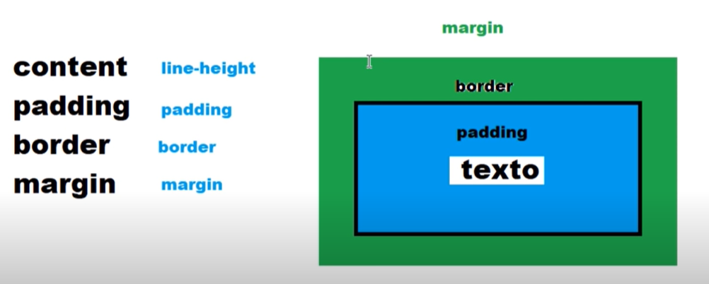

# Teoría de cajas en CSS
### Box model
* content: se modifica con line-height (Ejemplo: un texto)
* padding
* border
* margin



### Acá, Hablar de esas propiedades, content, padding, border y margin

### Margin
Dato: Para entrar una caja que no tenga posicionado, se agrega:
```css
.caja1 {
    margin: auto;
}
```
### Border  
Dato: Según sea **box-sizing: border-box;** ó **box-sizing: content-box;**, no hará más grande la caja y se dibujará en el interior o hará más grande la caja ocupando su exterior.

---

# Falta organizar!!!
## Propiedades

Pseudo clases
* hover

Estilo:
* **tamaño** (width y height)
* **box-sizing**. Valores:
            - content-box: La caja cambiará su tamaño según el tamaño de su contenido.
            -  border-box: La caja no cambiará su tamaño. Si el contenido es más grande, se desbordará hacia afuera, pudiéndose ocultar con la propiedad **overflow: hidden;**
* **overflow** (nos permite indicar qué hacer con aquello que se desborda de una caja)            
* **background** (permite cambiar color y/o imagen de fondo de la caja)
* **border** (size, tipo-solid, dashed,etc-, color)
* **border-radius** (esquinas redondeadas, se indica en grados. Ejemplo: 90deg)
* **padding** (relleno interno)
* **margin** (margen externo)
* **text-align** (alinea su content)
* box-shadow (valores: x, y, difuminado, borde, color)
* **transform** ( transform: rotate(90deg); )

