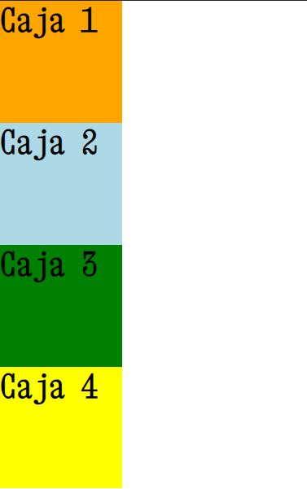
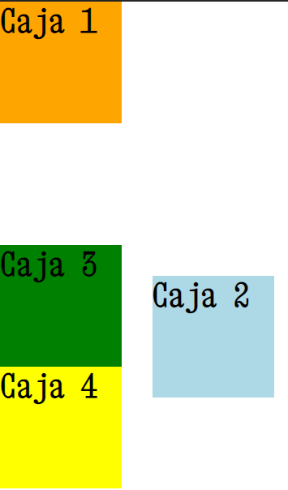
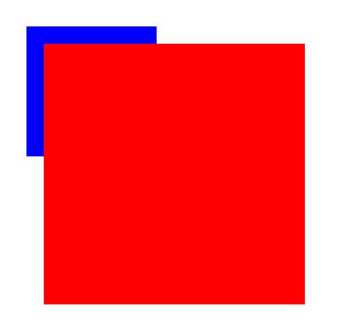

# Propiedad de caja: position
El flujo normal html lee línea a línea cada instrucción y se posiciona en la página de esa forma. Position viene a alterar ese flujo.

**Valores posibles:**
* static (valor por default - con esto no está posicionado)
* relative
* absolute
* fixed
* sticky

### Relative
Con este valor, el espacio original de la caja se conserva. Cuando movemos la caja usando las nuevas propiedades que nos da como top o left, la caja cambia su posición pero el espacio original que ocupaba se mantiene igual.

**Al posicionar una caja, obtenemos nuevas propiedades:**
* top
* right
* left
* bottom
* z-index
### Prioridades (top, left, right, bottom)
Las propiedades top y left tienen prioridad sobre bottom y right. Una vez que se establecen top y/o left ya no se tiene en cuenta lo que se ponga de bottom y right.
Recordar además, que se admiten valores negativos como **top: -50px;**.
#### Ejmplo de posición relativa:

```css
.caja1 {
    width: 120px;
    height: 120px;
}

.caja2 {
    width: 120px;
    height: 120px;
    position: relative; /*A simple vista, nada cambia
    pero ahora podemos modificar top. left, right, bottom, z-index*/

}

.caja3 {
    width: 120px;
    height: 120px;
}

.caja4 {
    width: 120px;
    height: 120px;
}
```


```css
.caja1 {
    width: 120px;
    height: 120px;
}

.caja2 {
    width: 120px;
    height: 120px;
    position: relative; /*aunque se mueve, mantiene la posición reservada original*/
    top: 150px; /*Aleja del top original 120px hacia abajo*/
    left: 130px; /*Aleja del left original 120px hacia la derecha*/
}

.caja3 {
    width: 120px;
    height: 120px;
}

.caja4 {
    width: 120px;
    height: 120px;
}
```

Como observamos, la posición original de la caja se mantiene (en blanco) y la caja se mueve a donde se le indició.
El punto de referencia desde donde se cuentan los pixeles para top o left es siempre el original de la caja.

### z-index para modificar las capas en el eje z
Si al usar posiciones relativas se superponen cajas, podemos modificar esas capas que se forman para indicar cuál debe estar más arriba y cuál más abajo. Para esto usamos la propiedad **z-index**.
```css
.caja1,
.caja2,
.caja3,
.caja4 {
    width: 120px;
    height: 120px;
}

.caja1 {
    background: orange;
}

.caja2 {
    background: lightblue;
    position: relative;
    top: 50px;
    left: 50px;
    z-index: 50;/*Se recomienda ir de 50 en 50 para evitar problemas
                en un futuro. Podríamos necesitar poner más capas entre la caja 2
                y 3, y si ponemos valores muy cercanos no tendríamos mucho
                lugar, en cambio, si desde el inicio vamos de 50 en 50, 
                tendremos 50 capas más entre la caja 2 y 3 para usar*/
}

.caja3 {
    background: green;
    position: relative; /*debemos posicionar para aquellos elementos
                         involucrados en capas de z-index*/

    z-index: 1; /*Si no agregamos esto, se considera z-index igual a cero*/
}

.caja4 {
    background: yellow;
}
```
### Conflictos entre elementos padres e hijos
Existen conflictos al usar **z-index** cuando se aplica a elementos padres e hijos. En general, el hijo siempre suporpone a su padre. Para cambiar esto, no aplican las mismas reglas antes vistas con cajas del mismo nivel. La única forma de lograrlo, es ponerle **position: relative;** al padre y **position: relative; z-index:-1**; al hijo, como se muestra a continuación.
```css
.contenedor {
    width: 300px;
    height: 300px;
    background: red;
    margin: 50px;
    position: relative;
}

.hijo {
    width: 150px;
    height: 150px;
    background: blue;
    position: relative;
    top: -20px;
    left: -20px;
    z-index: -1;
}
```


