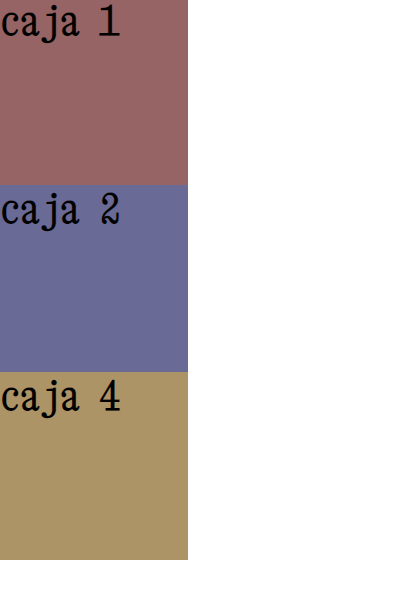
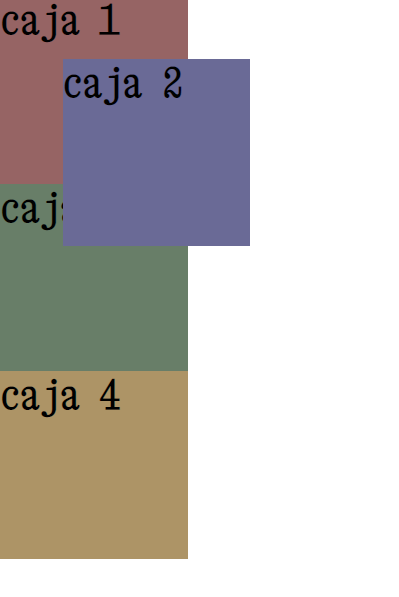
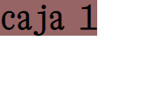
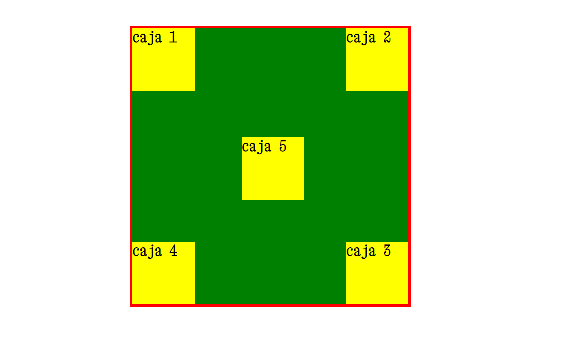

# # Propiedad de caja: position
El flujo normal html lee línea a línea cada instrucción y se posiciona en la página de esa forma. Position viene a alterar ese flujo.

**Valores posibles:**
* static (valor por default - con esto no está posicionado)
* relative
* **absolute**
* fixed
* sticky
## Absolute
Con este valor, el espacio original de la caja **NO** se conserva. Cuando movemos la caja usando las nuevas propiedades que nos da como top o left, la caja cambia su posición y el espacio original que ocupaba se pierde. Con esto, los otros elementos ocuparán ese vacío nuevo que quedó.

Observemos en el siguiente ejemplo, cómo al poner en caja 2 una posición absoluta, esta caja pierde su lugar y es ocupado por la caja 3 y 4 que mueven. La caja 2 queda detrás de la caja 3.
```css
.caja1,
.caja2,
.caja3,
.caja4 {
    width: 150px;
    height: 150px;
}

.caja1 {
    background: rgb(150, 100, 100);
}

.caja2 {
    background: rgb(106, 106, 150);
    position: absolute;
}

.caja3 {
    background: rgb(104, 126, 104);
}

.caja4 {
    background: rgb(173, 148, 102);
}
```


```css
.caja1,
.caja2,
.caja3,
.caja4 {
    width: 150px;
    height: 150px;
}

.caja1 {
    background: rgb(150, 100, 100);
}

.caja2 {
    background: rgb(106, 106, 150);
    position: absolute;
    top: 50px;
    left: 50px;
}

.caja3 {
    background: rgb(104, 126, 104);
}

.caja4 {
    background: rgb(173, 148, 102);
}
```

Como observamos, la posición original de la caja se pierde (deja un vacío que van a ocupar otros elementos) y la caja se mueve a donde se le indició.
El **punto de referencia** desde donde se cuentan los pixeles para top o left (x, y) es siempre el de su **contenedor** (esquina superior izquierda). Si no tuviera un contenedor, su **punto de referencia** será top, left (x, y) del **viewport** (esquina superior izquierda), es decir, todo lo que vemos de la web (no las partes del navegador como barras de tareas, barras de menú, etc.).

### Cajas con position absolute sin width ni height
En estos casos, donde no se indica ancho ni alto en cajas con position absolute, estas se ajustan a su contenido. En lugar de ocupar todo el ancho de su contenedor como hace todo elemento en bloque.

```css
.caja1 {
    background: rgb(150, 100, 100);
    position: absolute;
}
```
 

### ejemplo de posicionamiento de cajas
```css
div {
    /*todos los div*/
    background: green;
    position: absolute;
    /*todos con position absolute*/
}

div div {
    /*todos los div dentro del div contenedor*/
    width: 100px;
    height: 100px;
    background: yellow;
}

.contenedor {
    position: relative;
    margin: 50px auto;
    /*Se posiciona como relative
     para que se ocupe el lugar original
     y tome el margin en el eje x dado (auto)
     Además, al posicionarse, los hijos lo tomarán como 
     referencia en lugar de tomar al viweport*/
    border: 4px solid red;
    height: 450px;
    width: 450px;
}

.caja1 {
    top: 0;
    /*pegado al top del contenedor*/
}

.caja2 {
    top: 0;
    /*pegado al top del contenedor*/
    right: 0;
    /*pegado a la derecha*/
}

.caja3 {
    bottom: 0;
    /*pegado al bottom del contenedor*/
    right: 0;
    /*pegado a la derecha*/
}

.caja4 {
    bottom: 0;
    /*pegado al bottom del contenedor*/
}

.caja5 {/*así centramos el hijo en el padre*/
    top: 0;
    right: 0;
    bottom: 0;
    left: 0;
    margin: auto;
}
```
#### Resultado:



