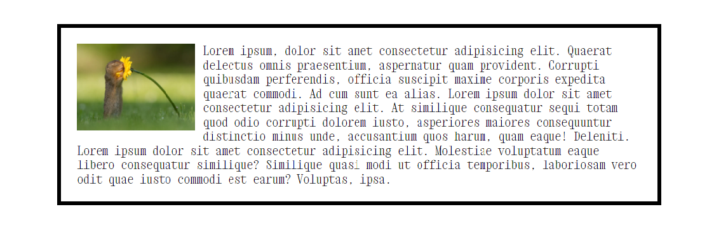

# Propiedad de cajas: Float
Esta propiedad era muy utilizado anteriormente, pero actualmente quedó en desuso por otras prácticas mejores.
De todas formas, hay un uso que se mantiene actualmente. Este se trata de envolver una imagen con texto.

## Ejemplo del único uso recomendable:
Se trabaja dentro de un contenedor. La imagen se coloca primero. 
A contnuación, colocamos el texto sin etiqueta.
### html
```html
<body>
    <div class="container">
        
        Lorem ipsum, dolor sit amet consectetur adipisicing elit. 
        Quaerat delectus omnis praesentium, aspernatur quam provident. 
        Corrupti quibusdam perferendis, officia suscipit maxime corporis
         expedita quaerat commodi. Ad cum sunt ea alias.
        Lorem ipsum dolor sit amet consectetur adipisicing elit. 
        At similique consequatur sequi totam quod odio corrupti 
        dolorem iusto, asperiores maiores consequuntur distinctio 
        minus unde, accusantium quos harum, quam eaque! Deleniti.
        Lorem ipsum dolor sit amet consectetur adipisicing elit. 
        Molestiae voluptatum eaque libero consequatur similique? 
        Similique quasi modi ut officia temporibus, laboriosam vero 
        odit quae iusto commodi est earum? Voluptas, ipsa.
    </div>
</body>
```
### CSS

```css
.container {
    margin: auto;
    margin-top: 50px;
    border: 5px solid black;
    width: 50%;
    padding: 20px;
}

img {
    float: left;
    width: 150px;
    margin-right: 10px;
}
```
### Resultado:
