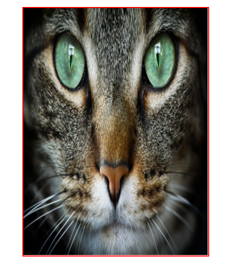
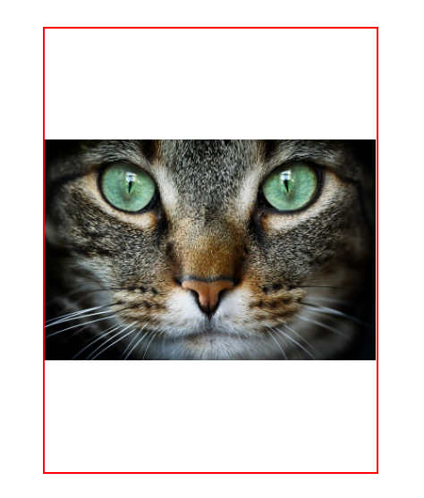
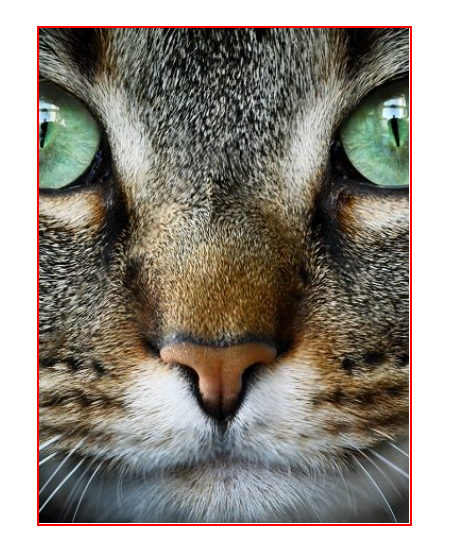
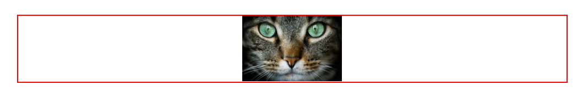

# Object-fit
Esta propiedad es usada en imágenes para manipular su tamaño.

**Valores:**
* contain
* cover
* none
* scale-down

### contain
Este valor evita la deformación de la imagen, si el contenedor no tiene la misma relación de aspecto. La imagen **se hace más pequeña**, mantiene su relación de aspecto y **se centra**.
#### Antes

```css
.caja {
    margin: 50px;
    width: 300px;
    height: 400px;
}

.caja img {
    width: 100%;
    height: 100%;
    border: 2px solid red;
    object-fit: contain;
}
```
#### Después

### cover
Este valor evita la deformación de la imagen, si el contenedor no tiene la misma relación de aspecto. La imagen **se hace más grande** que el contenedor, mantiene su relación de aspecto y **lo que sobra, se recorta**.
```css
.caja img {
    width: 100%;
    height: 100%;
    border: 2px solid red;
    object-fit: cover;
}
```
**Resultado:**

### none
Este valor usa los datos por defecto que vienen en la imagen y no tiene en cuenta el tamaño del contenedor. La imagen siempre va a **mantener su tamaño**, haciéndose **más pequeña** o **más grande y recortada**.
```css
.caja img {
    width: 100%;
    height: 100%;
    border: 2px solid red;
    object-fit: none;
}
```
### scale-down
Este valor, reduce el tamaño de la imagen para ajustarse a su contenedor siempre.
```css
.caja {
    margin: 50px;
    width: 800px;
    height: 100px;
}

.caja img {
    width: 100%;
    height: 100%;
    border: 2px solid red;
    object-fit: scale-down;
}
```
**Resultado:**

# Object-position
Con esta propiedad, podemos colocar la imagen con más presencia en el lado especificado, siempre respetando la propiedad object-fit dada.

**Valores:**
* center (valor por defecto)
* left
* right
* top
* bottom

#### Ejemplo que combina object-fit y object-position
El resultado es una animación que mueve una imagen dentro del contenedor de izquierda a derecha a partir de **object-position: right / left**, respetando la propiedad **object-fit: cover**.
```css
div {
    display: flex;
    border: 2px solid red;
    width: 300px;
    height: 400px;
}

img {
    object-fit: cover;
    object-position: right;
    transition: all 1s;
}

img:hover {
    object-position: left;
}
```