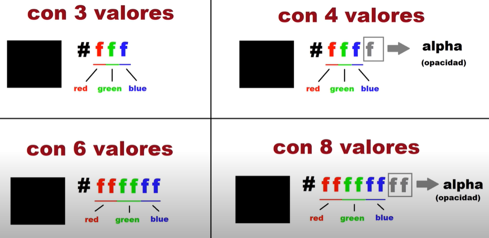

# Colorización en CSS
Existen diferentes formas de definir colores:
* color name
* hexadecimal
* rgb
* rgba
* hsla (casi no se usa)

### color name
Se da el valor de color a partir de nombres preexistentes. No es recomendable porque es el navegador el que decide qué intensidad le dará a cada uno. Si, por ejemplo, ponemos color: red; es el navegador el que decidirá qué tipo de rojo dará.
Para ver todos los nombres de colores disponibles, visitar la siguiente [web](https://htmlcolorcodes.com/es/nombres-de-los-colores/)
### hexadecimal
Para asignar este valor, se antepone el "#". Se utiliza el sistema hexadecimal para cada color rgb. El valor más bajo es cero, el valor máximo es f. Ejemplo: #f00 (rojo), #0f0 (azul), #fff (blanco). Si queremos más presición se puede poner dos dígitos para cada color. Ejemplo: #FF0000 (rojo).
Además, podemos controlar la opacidad agregando un dígito al final. Ejemplo: #000**8** (negro con opacidad media) ó #000000**88** (negro con opacidad media).

### rgb y rgba
Para esta colorización, usamos valores rgb entre 0 y 255 para cada color. Ejemplo: rgb(255, 0, 0) (rojo), rgb(0, 0, 255) (azul). Si queremos modificar la opacidad del color utilizamos el canal alfa que va desde 0 a 1. Ejemplo: rgba(255, 0, 0, 0.5) (rojo con opacidad al 50%), rgba(0, 0, 255, .85) (azul al 85%).
Para obtener códigos de colores fácilmente ir a la siguiente [web](https://htmlcolorcodes.com/es/)
Para conocer sobre los colores usados en material UI visitar esta [web](https://material-ui.com/es/customization/color/)