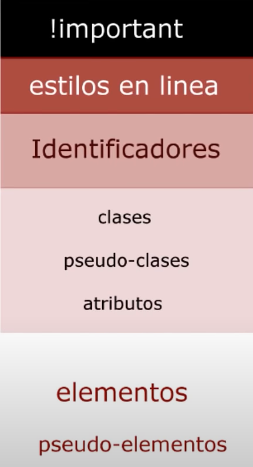

# Niveles de prioridad entre selectores

### Niveles de prioridad iguales:
En los casos en que los niveles de prioridad sean iguales, se aplicará siempre el último. En el ejemplo: "h1" recibiría el color azul.
```css
h1 {
    color: red;
}

h1 {
    color: blue;
}
```

En este siguiente caso, se afecta un "p" con "html" y después se lo vuelve a seleccionar con "p". Como los dos selectores son elementos (están en el mismo nivel), se aplica el último:
```css
html {
    color: red;
}

p {
    color: blue;
}
``` 
### Niveles de prioridad diferentes:

#### Algunos comentarios de la imagen:
El nivel de mayor prioridad es !important
En el siguiente ejemplo, gana el color rojo. Por más que los dos selectores sean elementos (igual prioridad), y debería ganar el último, el primero tiene !important y por eso tiene la prioridad.
```css
p {
    color: red !important;
}

p {
    color: blue;
}
```
A este, le siguen los atributos en línea, es decir, los que se escriben directamente en la etiqueta que se encuentra en el html
```html
<h1 style="color:red"></h1>
```
Después de los atributos en línea vienen los selectores por ID, estos le ganan a los selectores por clase, pseudo clase y atributos personalizados.
En el siguiente ejemplo gana el color rojo ya que su selector por ID tiene prioridad sobre clase y atributos personalizados.
```html
<div id="caja" cualquier-nombre-que-quiera="valor" class="cajitas"></div>
```
```css
#caja {
    color: red;
}
.cajitas {
    color: green;
}
[cualquier-nombre-que-quiera="valor"] {
    color: blue;
}
```
Finalmente, lo que menos prioridad tienen son los selectores de elementos y pseudo-elementos.